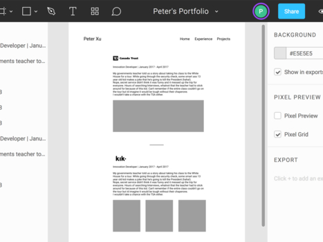

# Portfolio Site

## Description

Original portfolio site built on Angular v4.4.7 with initial scaffolding done with [Angular CLI](https://github.com/angular/angular-cli)(1.0.3).

Wireframes and prototypes made with Sketch and Figma. 

Check it out live [here](http://petercbxu.com)!

## Running Local Development Server

Project has dependencies that require Node 6.9.0 or higher, together with NPM 3 or higher. Using nvm is highly recommended.

Run `ng serve` for a dev server. Navigate to `http://localhost:4200/`. The app will automatically reload if you change any of the source files.

## Wireframe Screenshots

